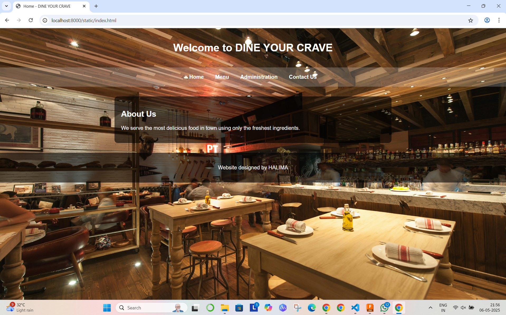
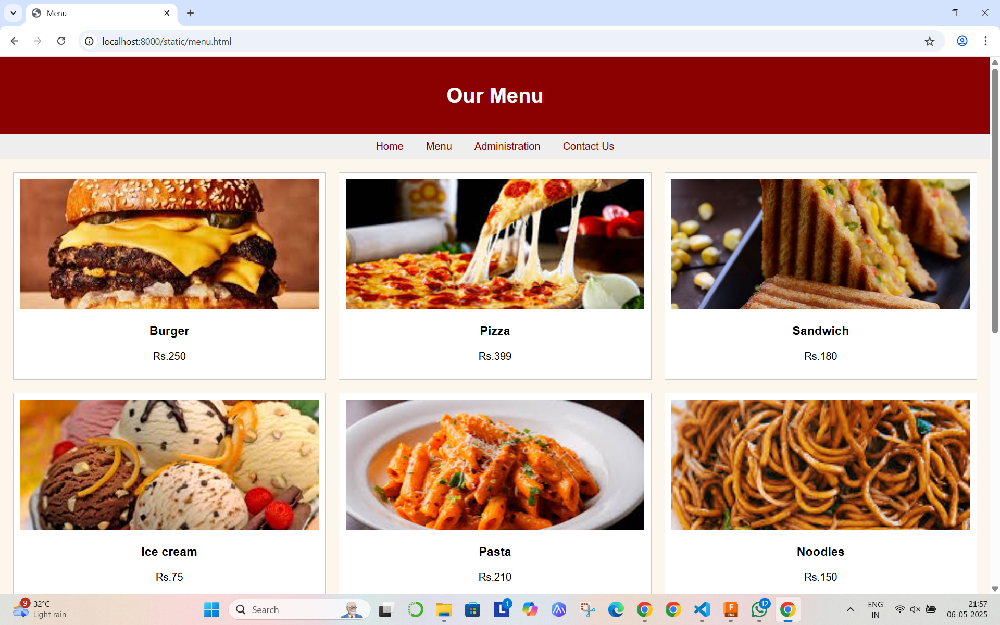
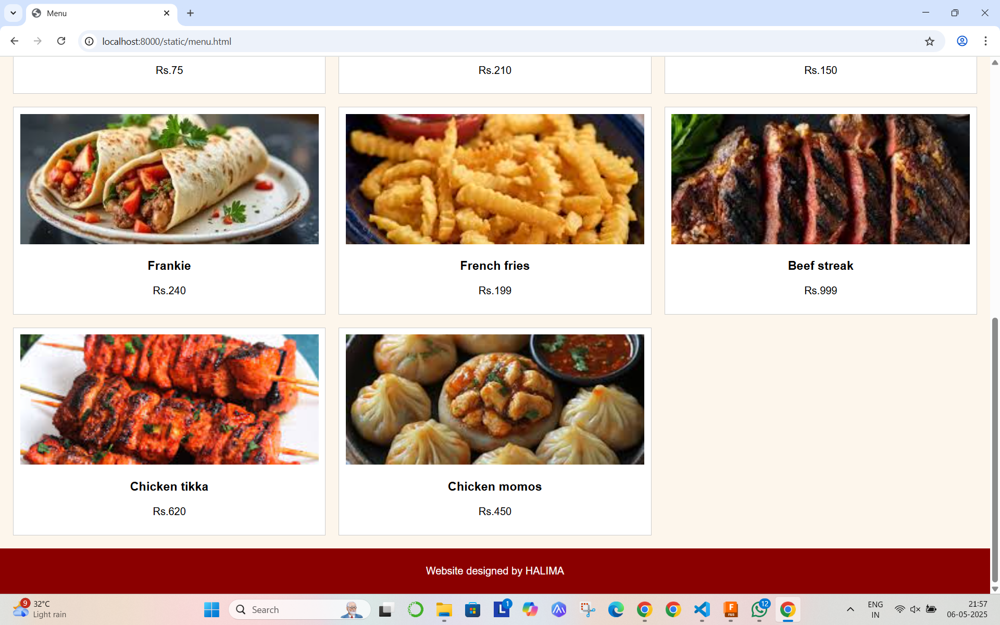
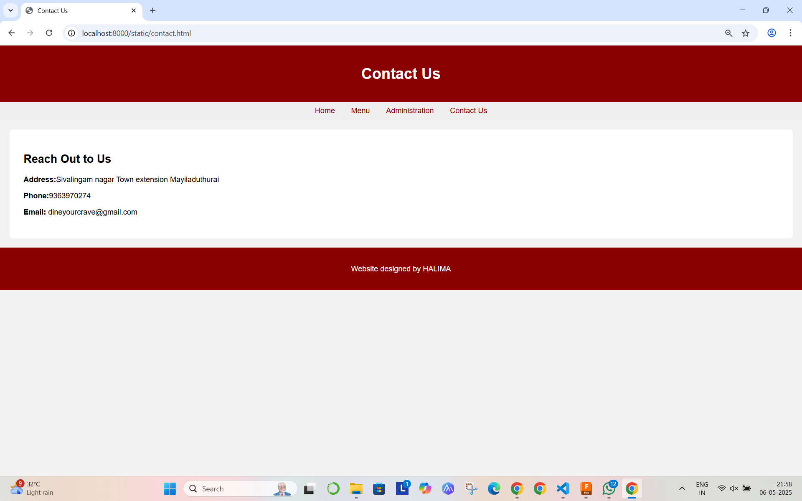

# Ex.07 Restaurant Website
# Date:
# AIM:
To develop a static Restaurant website to display the food items and services provided by them.

# DESIGN STEPS:
## Step 1:
Requirement collection.

## Step 2:
Creating the layout using HTML and CSS.

## Step 3:
Updating the sample content.

## Step 4:
Choose the appropriate style and color scheme.

## Step 5:
Validate the layout in various browsers.

## Step 6:
Validate the HTML code.

## Step 7:
Publish the website in the given URL.

# PROGRAM:
```
index.html
<!DOCTYPE html>
<html lang="en">
<head>
  <meta charset="UTF-8">
  <title>Home - DINE YOUR CRAVE</title>
  <link rel="stylesheet" href="home.css">
</head>
<body>
  <header>
    <h1>Welcome to DINE YOUR CRAVE</h1>
  </header>
  <nav>
    <a href="index.html">Home</a>
    <a href="menu.html">Menu</a>
    <a href="admin.html">Administration</a>
    <a href="contact.html">Contact Us</a>
  </nav>
  <div class="banner"></div>
  <div class="container">
    <h2>About Us</h2>
    <p>We serve the most delicious food in town using only the freshest ingredients.</p>
  </div>
  <footer>
    <p>Website designed by HALIMA</p>
  </footer>
</body>
</html>

home.css
body {
    margin: 0;
    font-family: Arial, sans-serif;
    background-image: url('bg.jpg');
    background-size: cover;
    background-repeat: no-repeat;
    background-attachment: fixed;
    background-position: center;
    color: #fff;
    min-height: 100vh;
    display: flex;
    flex-direction: column;
  }
  
  .container {
    width: 90%;
    max-width: 800px;
    margin: 30px auto;
    background-color: rgba(0, 0, 0, 0.6); /* semi-transparent bg */
    padding: 20px;
    border-radius: 10px;
  }
  
  header, nav, footer {
    text-align: center;
    padding: 20px;
  }
  
  nav {
    background-color: rgba(255, 255, 255, 0.2);
  }
  
  nav a {
    color: #fff;
    text-decoration: none;
    margin: 0 15px;
    font-weight: bold;
  }
  
  footer {
    background-color: rgba(0, 0, 0, 0.6);
  }
```

  ```
  menu.html
  <!DOCTYPE html>
<html lang="en">
<head>
  <meta charset="UTF-8">
  <title>Menu</title>
  <link rel="stylesheet" href="menu.css">
</head>
<body>
  <header>
    <h1>Our Menu</h1>
  </header>
  <nav>
    <a href="index.html">Home</a>
    <a href="menu.html">Menu</a>
    <a href="admin.html">Administration</a>
    <a href="contact.html">Contact Us</a>
  </nav>
  <div class="container">
    <div class="menu-grid">
      <!-- Repeat for 12 items -->
      <div class="item">
        
        <h3>Burger</h3>
        <p>Rs.250</p>
      </div>
      <div class="item">
        
        <h3>Pizza</h3>
        <p>Rs.399</p>
      </div>
      <div class="item">
        
        <h3>Sandwich</h3>
        <p>Rs.180</p>
      </div>
      <div class="item">
        
        <h3>Ice cream</h3>
        <p>Rs.75</p>
      </div>
      <div class="item">
        
        <h3>Pasta</h3>
        <p>Rs.210</p>
      </div>
      <div class="item">
        
        <h3>Noodles</h3>
        <p>Rs.150</p>
      </div>
      <div class="item">
        
        <h3>Frankie</h3>
        <p>Rs.240</p>
      </div>
      <div class="item">
        
        <h3>French fries</h3>
        <p>Rs.199</p>
      </div>
      <div class="item">
        
        <h3>Beef streak</h3>
        <p>Rs.999</p>
      </div>
      <div class="item">
        
        <h3>Chicken tikka</h3>
        <p>Rs.620</p>
      </div>
      <div class="item">
        
        <h3>Chicken momos</h3>
        <p>Rs.450</p>
      </div>
      <!-- Add 10 more -->
    </div>
  </div>
  <footer>
    <p>Website designed by HALIMA</p>
  </footer>
</body>
</html>

menu.css

body {
    font-family: sans-serif;
    background-color: #fdf6ec;
    margin: 0;
  }
  
  header {
    background-color: #8B0000;
    color: white;
    padding: 20px;
    text-align: center;
  }
  
  nav {
    background-color: #eee;
    text-align: center;
    padding: 10px;
  }
  
  nav a {
    margin: 0 15px;
    text-decoration: none;
    color: #8B0000;
  }
  
  .container {
    padding: 20px;
  }
  
  .menu-grid {
    display: grid;
    grid-template-columns: repeat(3, 1fr);
    gap: 20px;
  }
  
  .item {
    background-color: white;
    padding: 10px;
    text-align: center;
    border: 1px solid #ccc;
  }
  
  .item img {
    width: 100%;
    height: 200px;
    object-fit: cover;
  }
  
  footer {
    background-color: #8B0000;
    color: white;
    text-align: center;
    padding: 10px;
  }
  
  ```

  ```
  admin.html
  <!DOCTYPE html>
<html lang="en">
<head>
  <meta charset="UTF-8">
  <title>Administration</title>
  <link rel="stylesheet" href="admin.css">
</head>
<body>
  <header>
    <h1>Our Team</h1>
  </header>
  <nav>
    <a href="index.html">Home</a>
    <a href="menu.html">Menu</a>
    <a href="admin.html">Administration</a>
    <a href="contact.html">Contact Us</a>
  </nav>
  <div class="container">
    <div class="team">
      <!-- Repeat for 6 members -->
      <div class="member">
        
        <h3>Madhampatty rangaraj</h3>
        <p>Head Chef</p>
      </div>
      <div class="member">
        
        <h3>Jane Smith</h3>
        <p>Chef</p>
      </div>
      <div class="member">
        
        <h3>Jenifer</h3>
        <p>Manager</p>
      </div>
      <div class="member">
        
        <h3>John</h3>
        <p>Chef</p>
      </div>
      <!-- 4 more -->
    </div>
  </div>
  <footer>
    <p>Website designed by HALIMA</p>
  </footer>
</body>
</html>

admin.css

body {
    font-family: sans-serif;
    background-color: #f9f9f9;
    margin: 0;
  }
  
  header, footer {
    background-color: #8B0000;
    color: white;
    text-align: center;
    padding: 20px 10px;
  }
  
  nav {
    background-color: #ddd;
    text-align: center;
    padding: 10px;
  }
  
  nav a {
    margin: 0 15px;
    text-decoration: none;
    color: #8B0000;
  }
  
  .container {
    padding: 20px;
  }
  
  .team {
    display: grid;
    grid-template-columns: repeat(3, 1fr);
    gap: 20px;
  }
  
  .member {
    background: white;
    padding: 10px;
    text-align: center;
  }
  
  .member img {
    width: 100%;
    height: 200px;
    object-fit: cover;
  }
  
  ```

  ```
  <!DOCTYPE html>
<html lang="en">
<head>
  <meta charset="UTF-8">
  <title>Contact Us</title>
  <link rel="stylesheet" href="contact.css">
</head>
<body>
  <header>
    <h1>Contact Us</h1>
  </header>
  <nav>
    <a href="index.html">Home</a>
    <a href="menu.html">Menu</a>
    <a href="admin.html">Administration</a>
    <a href="contact.html">Contact Us</a>
  </nav>
  <div class="container">
    <h2>Reach Out to Us</h2>
    <p><strong>Address:</strong>Sivalingam nagar Town extension Mayiladuthurai </p>
    <p><strong>Phone:</strong>9363970274</p>
    <p><strong>Email:</strong> dineyourcrave@gmail.com</p>
  </div>
  <footer>
    <p>Website designed by HALIMA</p>
  </footer>
</body>
</html>

contact.css

body {
    font-family: sans-serif;
    background-color: #f2f2f2;
    margin: 0;
  }
  
  header, footer {
    background-color: #8B0000;
    color: white;
    text-align: center;
    padding: 20px;
  }
  
  nav {
    background-color: #eee;
    text-align: center;
    padding: 10px;
  }
  
  nav a {
    margin: 0 15px;
    text-decoration: none;
    color: #8B0000;
  }
  
  .container {
    padding: 30px;
    background-color: white;
    margin: 20px;
    border-radius: 8px;
  }
  
  ```


# OUTPUT:




.png>)



# RESULT:
The program for designing software company website using HTML and CSS is completed successfully.
